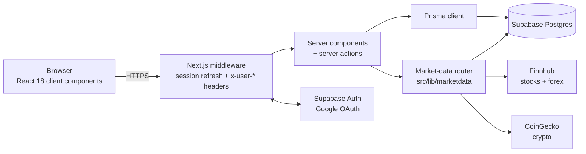

# Architecture

TradeLog is a single Next.js 14 (App Router) application backed by Supabase (Postgres + Auth) and deployed on Vercel. There is no separate backend service: pages are React Server Components that query the database through Prisma, and every mutation goes through a server action or an API route.

## System overview



## Authentication flow

Auth is Supabase Auth with Google OAuth, wired through `@supabase/ssr` cookies.

1. `src/middleware.ts` runs on every non-static request and delegates to `updateSession()` in [`src/lib/supabase/middleware.ts`](../src/lib/supabase/middleware.ts).
2. `updateSession()`:
   - **Strips** any incoming `x-user-id` / `x-user-email` / `x-user-name` / `x-user-avatar` headers, so a client can never spoof an identity.
   - Validates the session cookie with `supabase.auth.getUser()` (round-trip to Supabase, also refreshes expiring tokens).
   - Redirects unauthenticated requests to `/login` (except the public paths: `/login`, `/auth/callback`, `/api/test/login`, `/api/test/whoami`).
   - Re-injects the **trusted** `x-user-*` headers for the downstream render.
3. Server code reads identity via [`src/lib/auth.ts`](../src/lib/auth.ts):
   - `requireUser()` — returns the `User` row, creating it on first login. Wrapped in React `cache()`, so layout + page + actions in one request share a **single** DB roundtrip. Do not remove the cache wrapper.
   - `getSessionUserId()` — header read only, no DB hit.
4. `/auth/callback` exchanges the OAuth code for a session (with an open-redirect guard on the `next` param); `/auth/signout` (POST) clears it.

Prisma connects as the `postgres` role, which **bypasses RLS** — authorization is enforced in app code by scoping every query with `userId`. The RLS policies in [`prisma/rls_policies.sql`](../prisma/rls_policies.sql) are defense-in-depth for any future access under `anon`/`authenticated` roles (e.g. Supabase Storage).

## Route map

Public:

| Route                | Purpose                                               |
| -------------------- | ----------------------------------------------------- |
| `/login`             | Google OAuth entry                                    |
| `/privacy`, `/terms` | Legal pages                                           |
| `/auth/callback`     | OAuth code exchange                                   |
| `/auth/signout`      | POST — sign out                                       |
| `/api/health`        | Liveness probe (Prisma `SELECT 1`, 503 on DB failure) |

Authenticated — everything under the `(app)` route group shares the sidebar layout:

| Route         | Purpose                                                                         |
| ------------- | ------------------------------------------------------------------------------- |
| `/dashboard`  | Stats cards, cash-adjusted equity curve, top-movers strip, recent trades        |
| `/trades`     | Trade log with filters/sort; `/trades/new`, `/trades/[id]`, `/trades/[id]/edit` |
| `/positions`  | Open/closed positions; `/positions/[id]` with price chart tab                   |
| `/activity`   | Unified ledger of trades + cash flows                                           |
| `/watchlist`  | Tracked symbols with target-price distance                                      |
| `/analytics`  | Sector heatmap, allocation donut, TWR/MWR, projected dividends                  |
| `/playground` | What-if + DCA simulators (sandbox — no effect on real stats)                    |
| `/shared`     | Feed of trades friends opted to share                                           |
| `/settings`   | Profile, tags, data export, account deletion                                    |

API routes:

| Route                 | Purpose                                                          |
| --------------------- | ---------------------------------------------------------------- |
| `/api/tickers/search` | Symbol autocomplete — proxies the market-data router server-side |
| `/api/export`         | Full JSON export of the user's data                              |
| `/api/export/csv`     | CSV export of trades                                             |
| `/api/test/login`     | E2E-only login, gated to non-production + `TEST_AUTH_SECRET`     |
| `/api/test/whoami`    | E2E helper, same gating                                          |

## Mutations — server actions

No client-side DB access, ever. All writes are server actions grouped by domain under `src/app/(app)/*/actions.ts`:

| Domain     | Actions                                                                          |
| ---------- | -------------------------------------------------------------------------------- |
| trades     | `createTrade`, `updateTrade`, `deleteTrade` (soft), `restoreTrade`               |
| cashflows  | `createCashFlow`, `deleteCashFlow`                                               |
| tags       | `createTag`, `deleteTag`                                                         |
| watchlist  | `createWatchItem`, `deleteWatchItem`                                             |
| playground | `runWhatIf`, `saveWhatIfSnapshot`, `runDca`, `saveDcaSnapshot`, `deleteSnapshot` |
| settings   | `deleteAccount` (Supabase admin + Prisma cascade)                                |
| app-level  | `captureTimezone` (persists the browser's IANA timezone once)                    |

Every action validates input with the Zod schemas in [`src/lib/validators.ts`](../src/lib/validators.ts) and scopes by the session `userId`. Trade mutations run in a transaction together with `recomputePosition()` so position snapshots never drift from their legs.

## Directory layout

```
src/
├── middleware.ts             # Auth gate — see "Authentication flow"
├── app/
│   ├── (app)/                # Authenticated pages + their server actions
│   ├── api/                  # Export, health, ticker search, E2E-only login
│   ├── auth/                 # OAuth callback + signout
│   └── login/ privacy/ terms/
├── components/               # ui/ primitives + per-domain components
├── lib/
│   ├── auth.ts               # requireUser (React cache), getSessionUserId
│   ├── prisma.ts             # Prisma singleton (PRISMA_DEBUG=1 → query logging)
│   ├── supabase/             # Browser/server/middleware/admin clients
│   ├── marketdata/           # Provider router — see docs/market-data.md
│   ├── portfolio.ts          # TWR / MWR / equity-curve series — see docs/portfolio-math.md
│   ├── positions.ts          # Position math + recompute
│   ├── playground.ts         # What-if & DCA simulators (pure functions)
│   ├── stats.ts              # Win rate, avg win/loss, best/worst
│   ├── validators.ts         # Zod schemas shared by forms + actions
│   └── utils.ts              # calcPnL, formatters
└── prisma/schema.prisma      # See docs/data-model.md
```

## Design decisions

- **Server-only market data.** `src/lib/marketdata/*` must never be imported from a client component — provider API keys live in `process.env` and must not ship to the browser. The client reaches market data only via `/api/tickers/search` or data passed down from server components.
- **Money is `Decimal`, everywhere.** Postgres columns are `Decimal(20,8)`; server math uses `decimal.js`; conversion to `number` happens only at the display/chart boundary.
- **P&L is computed, never entered.** `calcPnL` in `src/lib/utils.ts`: `(exit − entry) × qty × directionSign − fees`.
- **Soft delete + audit trail.** Trades get `deletedAt` (with an Undo toast) instead of row deletion; edits to price/qty/direction/date fields append to `TradeRevision`.
- **Graceful degradation.** Any missing/stale market data renders as `—`, never a crash — free-tier providers fail often and that's expected.
- **Dates in UTC**, displayed in the user's captured IANA timezone.
- **Tailwind only** — no CSS modules or styled-components. Components stay under ~150 lines; logic is extracted into `src/lib` or hooks.
- **Row-click navigation inside `<tr>`** uses `onClick`/`onKeyDown` with `role="link"` — never an absolutely-positioned `<Link>` overlay (browsers ignore `position: relative` on `<tr>`, so the overlay covers the viewport; this bug shipped twice before being banned).
