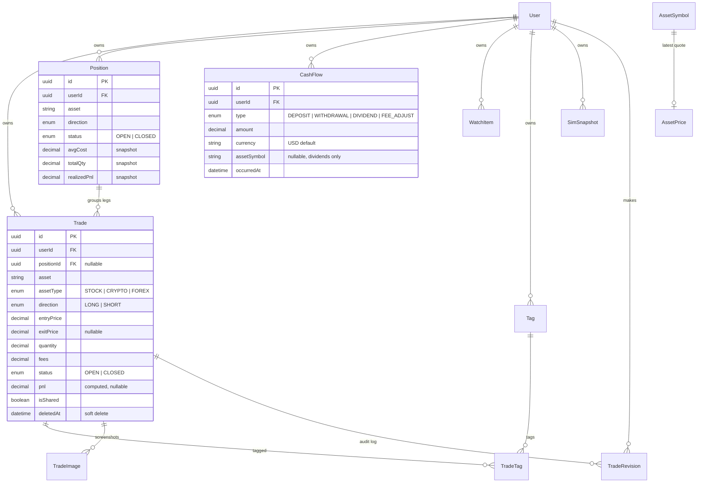

# Data model

Schema lives in [`prisma/schema.prisma`](../prisma/schema.prisma). Four migrations are applied to Supabase; two manual SQL files cover what Prisma can't express: [`prisma/manual_constraints.sql`](../prisma/manual_constraints.sql) (CHECK constraints) and [`prisma/rls_policies.sql`](../prisma/rls_policies.sql) (row-level security).

## Entity relationships



## Models

| Model              | Table                | What it is                                                                                      |
| ------------------ | -------------------- | ----------------------------------------------------------------------------------------------- |
| `User`             | `users`              | Mirrors Supabase Auth (`id` = auth UUID). Created on first login by `requireUser()`.            |
| `Trade`            | `trades`             | One complete round trip: entry, optional exit, fees, notes, `isShared`, soft delete.            |
| `TradeRevision`    | `trade_revisions`    | Append-only audit of edits to prices/quantity/direction/dates. Shown as "Edit history".         |
| `Tag` / `TradeTag` | `tags`, `trade_tags` | User-scoped labels with colors, unique per `(userId, name)`.                                    |
| `TradeImage`       | `trade_images`       | Screenshot attachments (Supabase Storage URLs).                                                 |
| `Position`         | `positions`          | Groups Trade legs on the same `(asset, direction)` while open. Snapshot fields, see below.      |
| `CashFlow`         | `cash_flows`         | Account-level money movements. Powers TWR/MWR and the Activity ledger.                          |
| `WatchItem`        | `watch_items`        | Symbols tracked but not owned, optional target price + direction. Unique per `(userId, asset)`. |
| `AssetSymbol`      | `asset_symbols`      | Cached resolved tickers (not user-scoped) + sector/industry + dividend yield.                   |
| `AssetPrice`       | `asset_prices`       | Latest known quote, exactly one row per symbol, overwritten on refresh.                         |
| `SimSnapshot`      | `sim_snapshots`      | Saved Playground scenarios (`kind: WHAT_IF \| DCA`, `params`/`result` JSON). Sandbox-only.      |

## Trade lifecycle

- A trade is `OPEN` until it has both `exitPrice` and `exitDate`; then it flips to `CLOSED` and `pnl`/`pnlPercent` are computed server-side — never user-entered:

  ```
  pnl = (exitPrice − entryPrice) × quantity × sign − fees      sign: LONG = +1, SHORT = −1
  pnlPercent = pnl / (entryPrice × quantity) × 100
  ```

- **Delete is soft**: `deleteTrade` sets `deletedAt` (the UI offers Undo via `restoreTrade`). Every list/detail query filters `deletedAt: null`.
- **Edits are audited**: `updateTrade` writes one `TradeRevision` row per changed tracked field (old value → new value).

## Position lifecycle

Positions are **derived state**, snapshotted for fast list reads and recomputed inside the same transaction as any trade mutation (`recomputePosition` in [`src/lib/positions.ts`](../src/lib/positions.ts)):

- New trades attach to the open position matching `(userId, asset, direction)` or create one (`getOrCreateOpenPosition`). LONG and SHORT on the same ticker are separate positions by design.
- `avgCost` = quantity-weighted average entry price across **OPEN** legs; `totalQty` = their summed quantity.
- `realizedPnl` = sum of `pnl` across **CLOSED** legs.
- When the last open leg closes, the position flips to `CLOSED` and stamps `closedAt`. When the last leg is deleted, the position row is deleted.

## Cash flows

Sign convention (applied in `src/lib/portfolio.ts`, amounts are stored positive):

| Type         | Effect on account value |
| ------------ | ----------------------- |
| `DEPOSIT`    | +                       |
| `DIVIDEND`   | +                       |
| `WITHDRAWAL` | −                       |
| `FEE_ADJUST` | −                       |

`assetSymbol` is set only on dividends — it links the payout to a ticker so the trade-detail page and analytics can attribute it. A `currency` column exists but the UI and aggregation are USD-only for now.

## Market-data cache tables

- `AssetSymbol` is populated on first ticker search and refreshed lazily. The `exchange` column is **overloaded on purpose**: for stocks it's the listing exchange, for crypto it's the CoinGecko coin id (e.g. `bitcoin`), for forex the Finnhub OANDA pair (e.g. `OANDA:EUR_USD`) — i.e. it's the provider lookup key. `sector`/`industry` and `dividendYield` are lazily enriched (7-day TTL) for analytics.
- `AssetPrice` holds exactly one latest quote per symbol (15-minute TTL, stale rows served on provider failure). History is intentionally **not** retained here; candles are fetched on demand and never persisted.

## Conventions

- All monetary values: `Decimal(20,8)` in Postgres, `decimal.js` in server code, formatted only on display.
- All timestamps stored UTC; rendered in the user's captured IANA timezone (`User.timezone`).
- Every user-owned table cascades on user deletion (`onDelete: Cascade`) — account deletion in Settings is Supabase admin delete + one Prisma cascade.
